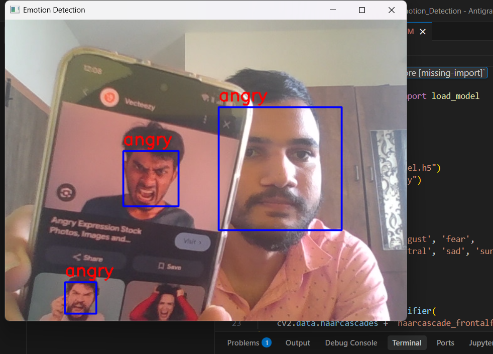
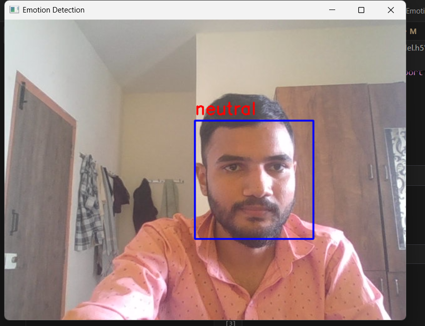

# Facial Emotion Recognition using CNN

This project performs real-time facial emotion detection using a Convolutional Neural Network (CNN) and OpenCV.

## Features
- Real-time webcam emotion detection
- CNN model trained on 7 emotions
- Haar Cascade for face detection
- Prediction smoothing for stable output

## Emotions Detected
- Angry
- Disgust
- Fear
- Happy
- Neutral
- Sad
- Surprise

## Technologies Used
- Python
- TensorFlow / Keras
- OpenCV
- NumPy
- Scikit-learn

## How to Run

1. Install dependencies:
                             pip install -r requirements.txt

2. Run:
                             python realtimedetection.py 

## Future Improvements
- Improve accuracy using deeper CNN
- Deploy as web application
- Add confidence score display

## Results

### Happy

### Sad

### Angry

### neutral
  
